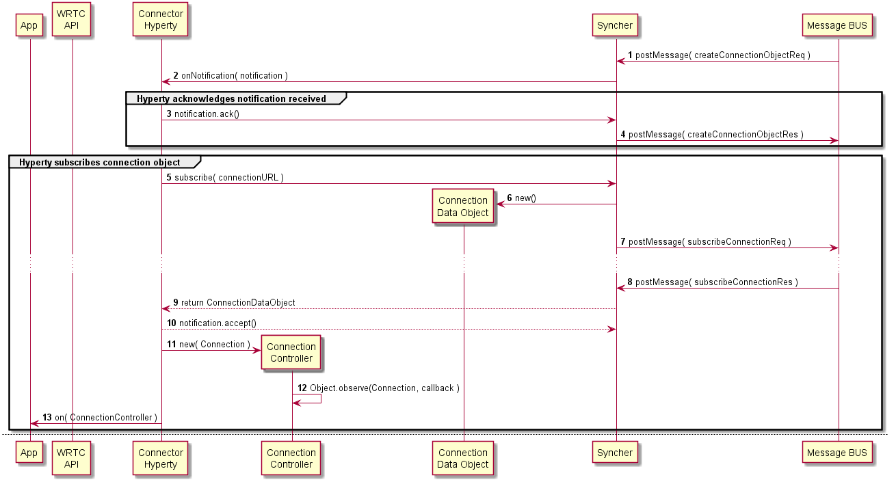
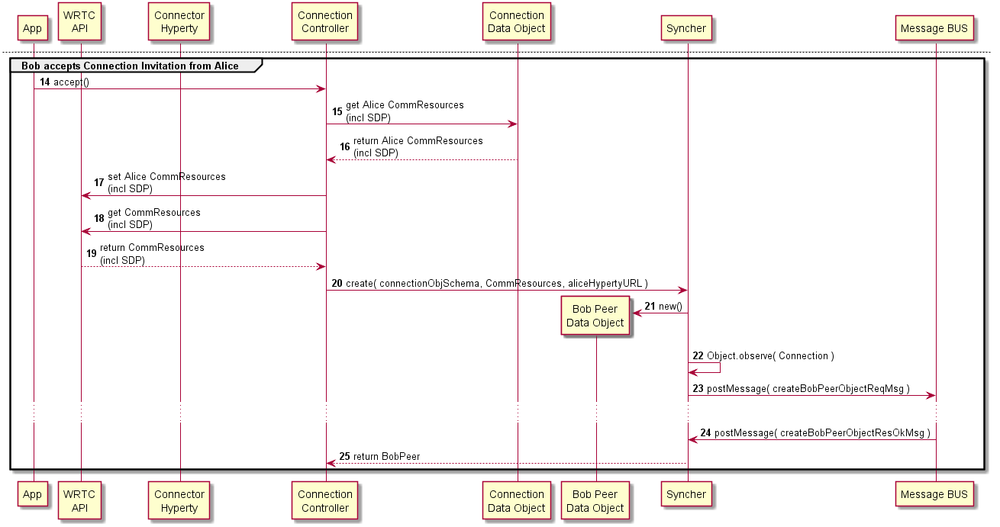
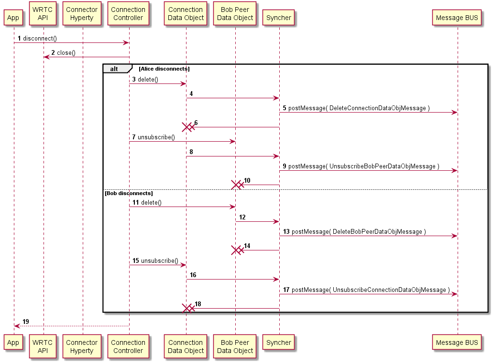

Connector Hyperty
-----------------

##1. Functionality description

The Connector Huperty main functionality is to handle two party audio and voice conversations.


As depicted above, the Connector Hyperty comprises the Connector class that handles the creation of new outgoing or incoming connections. Each Connection instance is controlled by the ConnectionController class that uses the the native WebRTC API.

The Connection signalling is handled by the Reporter-Observer data synchronisation mechanism, by using the standard [Connection Data schema](https://github.com/reTHINK-project/architecture/tree/master/docs/datamodel/connection).

##1.1 Hyperty Data Objects schemas

This Hyperty handles standard [Connection Data Objects](https://github.com/reTHINK-project/dev-service-framework/tree/master/docs/datamodel/data-objects/connection).

##1.2 Descriptor

The Hyperty Connector descriptor is:

```
"HypertyConnector": {
  "sourcePackage": {
    "sourceCode": ""
    "sourceCodeClassname": "HypertyConnector",
    "encoding": "base64",
    "signature": ""
    },
    "cguid": 10001,
    "hypertyType": [
    "audio",
    "video"
    ],
    "version": "0.1",
    "description": "Description of HypertyConnector",
    "objectName": "HypertyConnector",
    "configuration": {
    "webrtc": {
      "iceServers": [
        {
          "url": "stun:stun.l.google.com:19302"
        },
        {
          "url": "turn:194.65.138.95:3478",
          "credential": "luis123",
          "username": "luis"
        }
      ]
    }
    },
    "constraints": {},
    "sourcePackageURL": "/sourcePackage",
    "language": "javascript",
    "signature": "",
    "messageSchemas": "",
    "dataObjects": [
    "https://catalogue.hybroker.rethink.ptinovacao.pt/.well-known/dataschema/Connection"
    ],
    "accessControlPolicy": "somePolicy"
    }
```

The Hyperty Connector descriptor includes the required WebRTC ICE servers configuration:

```
"configuration": {
"webrtc": {
  "iceServers": [
    {
      "url": "stun:stun.l.google.com:19302"
    },
    {
      "url": "turn:194.65.138.95:3478",
      "credential": "luis123",
      "username": "luis"
    }
  ]
}
}
```

Since the Hyperty supports the standard connection data schema, any Catalog URL for that schema can be used.

##2. Exposed API

The Connector Hyperty implements two Hyperty APIs to be consumed by Applications:

* the Hyperty Connector API manages the creation of new WebRTC connections;
* the Hyperty ConnectionController API manages a certain WebRTC connection instance.

#### Hyperty Connector API

The Hyperty Connector API is used to create new connections.

##### onInvitation

This function is used to handle notifications about incoming requests to create a new connection.

**parameters**

**How to use it**

##### connect

This function is used to create a new connection providing the identifier of the user to be notified.

**parameters**

**How to use it**


#### Hyperty ConnectionController API

The Hyperty ConnectionController API is used to control a connection instance.

##### accept

This function is used to accept an incoming connection request.

**parameters**

**How to use it**

##### decline

This function is used to decline an incoming connection request.

**parameters**

**How to use it**

##### disconnect

This function is used to close an existing connection instance.

**parameters**

**How to use it**

##### onDisconnect

This function is used to receive requests to close an existing connection instance.

**parameters**

**How to use it**

### Main data flows

This section provides some details about how the WebRTC API is used by the Hyperty by using some Message Sequence CHart diagrams.

#### Hyperty initialisation

Application adds a listener to receive incoming connection requests events.


#### Create new Connection

Invite Bob for a new communication:


#### Notification about incoming connection request

Bob receives Connection Request notification:



#### Alice sends ICE Candidates to Bob

Alice is notified Bob has subscribed the Connection and can start receiving ICE Candidates:


Alice updates Connection with her Ice Candidates:


#### Accept incoming connection request

Bob accepts Connection Request:



#### Aknowledgment that requested Connection was accepted by remote peer

Alice is aknowledge that Bob accepts Connection Request:


#### Bob sends ICE Candidates to Alice

Similar to Alice sends ICE Candidates to Bob


#### Connection is closed by local peer

Connection is disconnected:


